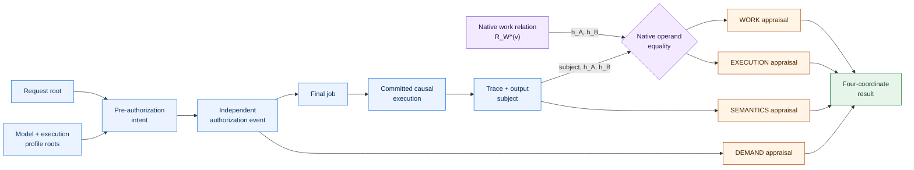

# Aeye

[](https://github.com/manfromnowhere143/aeye/actions/workflows/checks.yml)

**A falsifiable evidence calculus for inference: establish only the claim the evidence
actually supports, and preserve everything it does not.**

> **Current scientific state: `CONDITIONAL-GO`.** Aeye has one preregistered,
> `supported` toy execution-interface result, E-009-R1. A separate code path accepted all
> 13 frozen events and rejected all eight targeted mutations. The exact result vector is
> `WORK=unknown`, `EXECUTION=satisfied/sampled`, `SEMANTICS=satisfied/hybrid` for the
> declared finite-field toy profile, and `DEMAND=unsupported`. No native Pearl
> certificate, ordinary transformer or GPU execution, private inference, production
> efficiency, independent demand, or external review has been established.

The native byte path has nevertheless advanced beyond synthetic fixtures. A
preregistered owner calibration reconstructed 15 real public-checkpoint slab classes in
separate Python and Rust paths; both byte identities agreed, and both keyed roots agreed
with Pearl's pinned tree implementation under a synthetic non-candidate key. This is a
real-byte engineering result, not a certificate opening or an upgrade to the four-coordinate
vector. The public packet retains exact source, result, and input-provenance digests, but
not checkpoint or extracted-tensor payloads; a fresh clone alone cannot rerun MC1. See the
[pre-candidate evidence record](docs/E000_PRE_CANDIDATE_EVIDENCE_2026-09-21.md).

[Result](docs/E009_RESULT_2026-09-20.md) ·
[Mathematics](docs/FORMAL_COMPOSITION.md) ·
[2026 evidence map](docs/STATE_OF_THE_ART_2026.md) ·
[Technical frontier](docs/TECHNICAL_FRONTIER_2026.md) ·
[Pearl activation-origin binding](docs/PEARL_ACTIVATION_ORIGIN_BINDING_2026-09-21.md) ·
[Adversarial review response](docs/ADVERSARIAL_REVIEW_RESPONSE_2026-09-21.md) ·
[Replay](#reproduce) ·
[License](#license-citation-and-reuse)

## The one-minute thesis

A cryptographically valid artifact can answer the wrong question.

A proof of matrix work does not show that the matrix belonged to a requested inference. A
proof of a quantized circuit does not show that a named GPU executed it. A hardware quote
does not show that every serving event followed the intended model semantics. A payment
does not show that the paid computation was useful or even requested independently.

Aeye therefore refuses to emit one reassuring “verified inference” bit. It preserves four
claims as separate coordinates:

| Coordinate | Exact question | Evidence that cannot substitute for it |
|---|---|---|
| `WORK` | Was a stated class or lower bound of computation evidenced? | A model identifier, output commitment, attestation, or payment |
| `EXECUTION` | Did the evidenced operands occur on the committed causal path from this request and model to this output? | Work over unrelated, replayed, or garbage operands |
| `SEMANTICS` | Did covered events follow the named arithmetic, compiler, and hardware semantics? | Correct algebra under a different field, precision, kernel, or device model |
| `DEMAND` | Did an independently committed authorization or qualifying economic event precede the job? | Provider-created traffic, circular payment, or useful-looking output |

Every coordinate carries its own assurance, coverage denominator, assumptions, evidence,
and unknowns. Success in one coordinate never promotes another. Aeye is not a new proof
primitive; it is a composition and appraisal layer for determining what heterogeneous
evidence actually establishes.

## The missing composition relation

Aeye began with a precise Pearl question: what additional relation is required before
accepted proof-of-useful-work can be attributed to a particular inference?

For a version-pinned Pearl context, let

\[
R_W^{(v)}(\omega_v,h_A,h_B;\pi_W)=1
\]

be Pearl's native work statement over clean operand commitments `h_A,h_B`. Let

\[
R_X(\sigma,h_A,h_B;\pi_X)=1
\]

mean that those exact operands were consumed by checked events on the causal path of an
Aeye subject `sigma`, which binds the request, model and execution profile, job, trace, and
output. The coupled statement is only

\[
R_{WX}^{(v)}=R_W^{(v)}\land R_X.
\]

This is a strict extension of the **claim surface**, not a replacement for Pearl. The
coupled statement projects to native Pearl work; the reverse implication fails when valid
work is replayed, unrelated to the request, paired with invalid activations, or detached
from the final output. Writing the same job identifier into two envelopes does not create
this relation. Both native evidence systems must authenticate the same non-null operand
roots.



## E-009-R1: the first claim-bearing result

E-009-R1 was frozen by preregistration digest before execution. It uses a small public
finite-field, transformer-inspired causal block. It is not an ordinary transformer or
language model. The block has one complete 13-event universe. The verifier receives the
full public model, input, and trace:

- five matrix-vector transitions checked through authenticated coded-linear relations;
- cache append, attention scores, hard-attention selection, residual, ReLU, argmax, and
  output boundaries replayed exactly;
- the complete trace and output committed before all 80 sparse challenges;
- a verifier that imports neither the provider generator nor the earlier demonstrator;
- eight preregistered mutation controls with required failure codes.

| Retained observation | E-009-R1 |
|---|---:|
| Frozen semantic-event coverage | 13 / 13 |
| Coded-linear relations | 5 |
| Post-subject coded equations | 80 / 80 accepted |
| Exact state, nonlinear, decode, and output relations | 8 / 8 accepted |
| Targeted preregistered mutations | 8 / 8 rejected with the expected code |
| Conditional five-relation union bound | approximately `4.99e-25`, below `2^-80.73` |
| Decoded output | token ID `3`, `iris` |

The result is deliberately asymmetric:

| Coordinate | R1 status | Exact ceiling |
|---|---|---|
| `WORK` | `unknown` | Synthetic clean-operand roots only; no Pearl certificate or mining relation was generated or verified |
| `EXECUTION` | `satisfied / sampled` | The frozen public toy relation and its complete 13-event denominator only |
| `SEMANTICS` | `satisfied / hybrid` | Prime-field, centered-decode, hard-attention semantics only; no native float, GPU, compiler, or kernel claim |
| `DEMAND` | `unsupported` | Operator authorization records research provenance, not an independent request or economic event |

### What the result means and what it does not

E-009 is a constructive witness that `R_X(subject,h_A,h_B)` can exist as executable,
falsifiable machinery rather than prose. It binds one synthetic WORK-side operand pair to
the same roots used by a complete declared execution path without allowing that equality
to upgrade `WORK`.

It is an **interface result**, not an efficiency result. At this scale, direct matrix
recomputation is cheaper, exact, and stronger than the coded audit. The audit exists to
exercise the protocol boundary needed by a future authenticated-preprocessing design; it
does not improve this toy computation.

The eight mutations are targeted regression and substitution controls. They demonstrate
that named invalid artifacts are rejected; they are not a proof against every transcript a
malicious provider could regenerate consistently. A later `observed-post-hoc` probe changed
one linear output, regenerated every downstream event and commitment, and falsified the
retained acceptance fields. The verifier rejected it only through the coded relation and
its aggregate transcript diagnostics; binding, ordering, and exact downstream-event checks
added no separate rejection. Code-path separation also is not independent human,
institutional, or cryptographic review. See the [E-009-R1 result](docs/E009_RESULT_2026-09-20.md)
and [adversarial review disposition](docs/ADVERSARIAL_REVIEW_RESPONSE_2026-09-21.md).

## Complete toy cost surface

The measured environment was CPython 3.14.2 on macOS 14.4 arm64. Provider timings used
100 warmups and 1,000 repetitions; verifier timings used 100 warmups and 250 repetitions.
They are local microbenchmarks, not serving estimates.

| Operation | Median | p95 | Interpretation |
|---|---:|---:|---|
| Identical causal-block execution without Aeye | 29.458 µs | 31.541 µs | Frozen baseline |
| Offline preprocessing for all five matrices | 167.334 µs | 175.042 µs | Separate setup cost |
| Online execution, trace, and final subject | 112.041 µs | 119.000 µs | About 3.80× the toy baseline |
| Combined post-subject challenges and coded responses | 1,461.354 µs | 1,567.292 µs | About 49.61× the toy baseline |
| Independent relation replay | 1,940.771 µs | 2,131.667 µs | About 65.88× the toy baseline |

A later, explicitly `exploratory-post-hoc` split measured 703.584 µs median for client
challenge derivation and 699.687 µs for provider response construction. It changes no R1
claim. The provider bundle is 85,584 bytes for a 222-byte canonical output, about 385.5×
larger. Network, recovery, long-term storage, privacy, and production hardware costs remain
unmeasured.

These numbers are evidence **against** claiming practical advantage from R1.

The post-hoc operation count is equally adverse: authenticating all five `Q=G^T M`
objects costs 832 field multiplications, while exact replay of all five `Mx` products costs
90. Within that narrow count, the coded path is 9.244444× more expensive and has weaker
soundness. Hashing, additions, parsing, and other verifier work are excluded. R1's coded
audit therefore has negative system value at this scale; its only value is exercising a
future interface in which preprocessing would already be authenticated and amortized.

## Position in the 2026 verification landscape

The retained literature does not contain one mechanism that establishes all four Aeye
coordinates. The systems below solve different relations; their overhead percentages are
not interchangeable.

| Evidence family | Strongest relevant capability | Boundary Aeye keeps explicit |
|---|---|---|
| Pearl proof-of-useful-work | Evidence for committed matrix work under a version-specific native relation | Does not bind a complete request, model execution, output, or independent demand |
| Maverick-style delegated MVM verification | Low-server-overhead linear-transition checking with transparent preprocessing | Preprocessing authentication, nonlinear/stateful completeness, transferability, and full system cost remain separate |
| DeepProve, zkGPT, and Jolt Atlas | Strong quantized or compiled-model execution relations | Encoded semantics are not native GPU provenance, physical work, or demand |
| Artemis | Efficient consistency between a proof witness and an external homomorphic polynomial commitment | Pearl's keyed BLAKE3 roots are not that interface; a reviewed translation relation is still required |
| Hawkeye and MMA-Sim | Empirical reproduction of selected accelerator arithmetic | Arithmetic conformance is not execution provenance or complete serving semantics |
| Optimistic, sampled, TEE, and statistical audits | Lower-cost conditional evidence under an honest-party, attestation, or detection model | Trust, prevalence, availability, privacy, and coverage assumptions remain visible |
| Aeye E-009-R1 | One complete toy execution subject with separate result coordinates | Native Pearl work, realistic semantics, scale, privacy, competitive cost, and independent review remain open |

Aeye's proposed contribution is therefore not “a better SNARK” or “a better PoUW.” It is
the native-input composition contract, complete event denominator, and non-laundering
result calculus needed to combine such systems without claiming that one proves another.
The detailed, source-pinned comparison is in the
[2026 state-of-the-art review](docs/STATE_OF_THE_ART_2026.md).

## The next evidence moves

The highest-value next move is not a larger toy. Two bounded outputs should precede
another protocol claim:

1. **One E-000 public-weight opening.** Under a reviewed successor freeze, reconstruct a
   future-selected dense certificate-v3 `hash_b` from a finite registry of published
   checkpoint revisions through Pearl's pinned fusion, slicing, tensor parallelism,
   layout, padding, and keyed-BLAKE3 path. Preserve `INVALID`, `BLOCKED`, `UNRETRIEVED`,
   `OUT_OF_COVERAGE`, `MATCH`, and `IN_COVERAGE_NO_MATCH` as distinct terminal states. A
   census becomes a separately frozen E-001 only if the pilot's availability, coverage,
   and decision value justify it. A 15-class real-byte tree calibration is retained, but
   no candidate opening or census result exists today.
2. **A row-consistent quantizer-consistency precursor, then a native origin bridge.** The
   [source-pinned note](docs/PEARL_ACTIVATION_ORIGIN_BINDING_2026-09-21.md) identifies the
   exact selected-strip witness already authenticated under `hash_a`, corrects the nuance
   that `job_key` inherits the block transaction root, and specifies a companion relation
   that proves origin and opens the same bytes at the same positions. It also exposes the
   scales and execution-profile material omitted from Pearl's operand roots and prices the
   BLAKE3 surface exactly. The first bounded experiment may test only whether disclosed
   pre-quantization rows map to committed INT bytes under one declared quantizer profile.
   That is `SEMANTICS` evidence for the named quantizer. It does not establish request
   binding, activation origin, or `EXECUTION`. PAB-1 remains a proposal, not an
   implementation or security result.

```mermaid
flowchart LR
    accTitle: Aeye evidence program after E-009
    accDescr: The supported toy result branches into an empirical Pearl public-weight census and a Pearl-native binding analysis. Only after those boundaries are fixed does authenticated preprocessing lead toward an actual Pearl adapter, realistic semantics, and independent review.

    R1["E-009-R1<br/>supported toy interface"] --> C{"Next discriminating<br/>evidence"}
    C --> E0["E-000<br/>one frozen public-weight opening"]
    C --> BM["PAB-0a row-consistent<br/>quantizer consistency"]
    E0 --> ER["Pilot result<br/>or explicit unknowns"]
    ER --> E1["Conditional E-001<br/>preregistered census"]
    BM --> PAB["PAB-1 native origin relation<br/>with measured boundary"]
    PAB --> APC["APC-1 / E-010<br/>authenticated preprocessing"]
    APC --> P["Version-pinned native<br/>Pearl root adapter"]
    P --> S["Realistic semantics +<br/>full-cost comparator"]
    S --> V["Independent domain-expert<br/>review"]

    classDef supported fill:#e6f4ea,stroke:#1a7f37,color:#0f3d1c;
    classDef proposed fill:#fff4e5,stroke:#b54708,color:#4a2500;
    classDef blocked fill:#fff1f0,stroke:#cf222e,color:#4c1114;
    class R1 supported;
    class C,E0,BM,PAB,APC proposed;
    class ER,E1,P,S,V blocked;
```



E-000 is `blocked` before execution. The amendment readback is complete, and
[ADR-0012](docs/decisions/0012-pre-candidate-freezes-precede-operator-acceptance.md) is
incorporated: two independent implementations, the 30-control gate, a finite T1 registry,
the transformation recipe, and a fresh reviewer readback all precede exact operator
acceptance. [ADR-0013](docs/decisions/0013-immutable-manifest-and-external-acceptance-bindings.md)
keeps the protocol manifest immutable and makes the fresh review and acceptance records
bind it externally. The old digest triple remains historical and has no current authority.
No candidate block, certificate, or `hash_b` may be selected or inspected before those
gates. The current conformance instruments are described in the
[E-000 experiment note](experiments/e-000/README.md).

After that manifest freeze, owner-side pre-candidate work derived 3,248
dimension-prequalified 8B layouts, obtained cross-language equality for their byte
identities, and completed the 15-class MC1 keyed-root calibration described above. A
separate exporter calibration terminated on an early EOF before its declared
`Content-Length`; its stop rule correctly prevented the second capture and comparison.
The active source tier remains unchanged, while
[ADR-0015](docs/decisions/0015-source-assurance-requires-independent-derivation.md)
proposes replacing route diversity with explicit publisher-associated and independently
derived source classes. That proposal requires adversarial readback and a new immutable
manifest before it can affect E-000.

### The next protocol construction

R1 authenticates each preprocessing object `Q=G^T M` by recomputing it from the full public
matrix. That is correct and unscalable: a large-model verifier loses the intended advantage.
Without authentication, however, a provider can substitute `M'`, publish
`Q'=G^T M'`, compute `y=M'x`, and satisfy every online coded equation for the wrong model.

The proposed Authenticated Preprocessing Capsule separates two relations:

\[
R_{setup}(r_M,r_Q,\lambda;\pi_{setup})=1,
\qquad
R_{online}(r_Q,x,y,\sigma;\pi_{online})=1,
\]

where `r_M` binds the exact model and layout, `r_Q` binds its preprocessing, and `sigma`
binds the request-specific execution subject. A sumcheck/polynomial-commitment backend is
a candidate, not a selected or implemented proof system. Maverick already identifies
proof-backed preprocessing validation as an option; Aeye's open question is the exact
model/layout/root and receipt composition needed to make it reusable.

The next experiment should not enlarge the toy matrix. It should either authenticate and
amortize preprocessing against an exact model root, or show that the approach cannot beat
a complete proof after provider, client, verifier, network, storage, privacy, and recovery
costs are counted. The formal proposal and falsifiers are in
[Authenticated Preprocessing Capsule](docs/AUTHENTICATED_PREPROCESSING_CAPSULE.md).

## Evidence boundary

Established in this repository:

- a cycle-free `intent → authorization → job → subject` construction;
- a four-coordinate composition calculus with explicit coverage and unknowns;
- a version firewall between Pearl INT certificate-v3 and proposed FP8 certificate-v4;
- a content-addressed primary-source ledger with exact public retrieval locators, pinned
  repositories, and fail-closed digest verification;
- deterministic checks for native-input binding, ordering, assumptions, coverage,
  cross-evidence equality, reviewer identity, and retained-artifact integrity;
- 18 structural fixtures, including 15 designed failures;
- the preregistered E-009-R1 transcript, independent code-path replay, measurements, and
  targeted mutation suite;
- one separately labelled post-hoc self-consistent-forgery probe, rejected by the coded
  relation without being folded into the frozen R1 result.
- a source-pinned PAB-1 companion-relation proposal for binding Pearl's exact selected
  activation-strip witness to a request/model/pre-state origin; it remains unimplemented.
- a pre-candidate E-000 V3 parser, exact byte-transform engine, separately written BLAKE3
  reference lane, and pinned Pearl root oracle; these are conformance instruments, not a
  mainnet opening or the two frozen independent implementations.
- a preregistered E-000 MC1 owner calibration over 15 real public-checkpoint slab classes,
  with equal Python/Rust byte identities and equal Python/Rust/Pearl keyed roots under a
  synthetic key; this is not a candidate `job_key` or native opening.
- a typed terminal record for the failed exporter calibration and a candidate-blind source
  assurance proposal; neither changes the active E-000 gate.

Not established:

- live Pearl certificate verification or a bridge consuming native Pearl operand roots;
- ordinary transformer, FP8/B200, GPU, compiler, kernel, energy, or physical-work
  semantics;
- authenticated preprocessing that avoids full-matrix verifier work;
- private or zero-knowledge inference, production serving, or competitive overhead;
- mainnet operand participation, utility, economic demand, or non-circular payment;
- independent cryptographic, systems, protocol-engineering, or peer-review acceptance.

The dated verdict is **`CONDITIONAL-GO / FIRST CLAIM-BEARING TOY RESULT / FRONTIER
SYSTEM VALUE UNPROVEN`**.

## Reproduce

A fresh clone does not contain third-party paper, standard, patch, or source-repository
payloads. Materialize exact public bytes and commits from the ledger, with every result
checked against its retained digest, then run the local gates:

```bash
python3 scripts/hydrate_external_evidence.py
python3 scripts/validate.py
python3 experiments/e-009/independent_verify.py
python3 experiments/e-009/posthoc_adversarial_probe.py
python3 -m unittest discover -s tests -v
```

Expected high-level result:

```text
Aeye validation: 0 repository error(s); 18 fixture(s) exercised; 15 rejected as designed
E-009 independent replay: ACCEPT
coordinates: DEMAND=unsupported, EXECUTION=satisfied, SEMANTICS=satisfied, WORK=unknown
known-bad controls: 8/8 rejected
```

Hydration requires network access only to retrieve ledger-pinned public sources. The
payloads remain ignored and are not redistributed by this repository. Validation and
E-009 replay are otherwise local and make no chain transaction, provider call, model call,
or credential request. Replaying the same code is reproducibility, not independent review.

Required CI is deliberately independent of third-party availability. It runs
`scripts/validate.py --allow-unhydrated-external`; that mode validates every Aeye-owned
artifact and the complete ledger contract, verifies any external artifact that is present,
and states explicitly that absent external bytes were not checked. The full command above
remains the evidence-hydrated replay.

## Repository map

| Purpose | Start here |
|---|---|
| Mission and claim ceiling | [Scientific charter](docs/SCIENTIFIC_CHARTER.md), [claims and non-claims](docs/CLAIMS_AND_NON_CLAIMS.md) |
| Formal statement | [Composition calculus](docs/FORMAL_COMPOSITION.md), [protocol specification](docs/PROTOCOL_SPEC.md) |
| Current result | [E-009-R1 report](docs/E009_RESULT_2026-09-20.md), [adversarial disposition](docs/ADVERSARIAL_REVIEW_RESPONSE_2026-09-21.md), [dated verdict](docs/VERDICT_2026-09-20.md) |
| Current frontier | [Technical frontier](docs/TECHNICAL_FRONTIER_2026.md), [PAB-1 proposal](docs/PEARL_ACTIVATION_ORIGIN_BINDING_2026-09-21.md), [APC-1 proposal](docs/AUTHENTICATED_PREPROCESSING_CAPSULE.md) |
| Native Pearl pilot | [E-000 instrument](experiments/e-000/README.md), [pre-candidate evidence](docs/E000_PRE_CANDIDATE_EVIDENCE_2026-09-21.md), [MC1 packet](experiments/e-000/mc1/README.md), [experiment manifest](experiments/e-000/manifest.json) |
| Evidence and prior art | [2026 review](docs/STATE_OF_THE_ART_2026.md), [source ledger](evidence/ledger/sources.json), [research lineage](docs/RESEARCH_LINEAGE.md) |
| Adversarial method | [Threat model](docs/THREAT_MODEL.md), [review protocol](docs/REVIEW_PROTOCOL.md), [experiment program](docs/EXPERIMENT_PROGRAM.md) |
| Review continuity | [Session handoff](docs/SESSION_HANDOFF.md), [expert-review brief (unsent)](docs/EXPERT_REVIEW_BRIEF_DRAFT.md) |
| Contribution and disclosure | [Contributing](CONTRIBUTING.md), [security policy](SECURITY.md), [editorial policy](docs/EDITORIAL_POLICY.md) |

## License, citation, and reuse

Aeye-authored code, schemas, fixtures, experiments, and documentation are licensed under
the [Apache License 2.0](LICENSE). Copyright 2026 Daniel Wahnich. Contributions use the
same terms unless explicitly stated otherwise.

The Aeye license does **not** relicense third-party papers, standards, patches, or external
repositories. Those payloads are absent from Git; the ledger records their official
locators and exact digests for local hydration. Each remains subject to its publisher's or
upstream project's terms. See [NOTICE](NOTICE), the [licensing boundary](docs/LICENSING.md),
and the [public-release inventory](docs/PUBLIC_RELEASE_INVENTORY_2026-09-21.md).

Use [CITATION.cff](CITATION.cff) and identify the exact commit and E-009 artifact digests
reviewed. Repository availability, a passing replay, or a citation does not confer
scientific endorsement.

## Research posture

Aeye is pre-deployment research. There is no production runtime, public-chain transaction,
credential use, private-data ingestion, model-weight release, security certification, or
performance claim.

The most useful response is not applause. It is a counterexample: a consistently forged
transcript that passes, an omitted event hidden outside the denominator, a semantic
substitution, a model-root mismatch, an unaccounted setup cost, or a simpler relation that
establishes the same claim.

**Aeye** is a working research-system name. Public repository visibility does not establish
name availability, ownership, trademark status, token design, company formation, scientific
acceptance, or production readiness.
