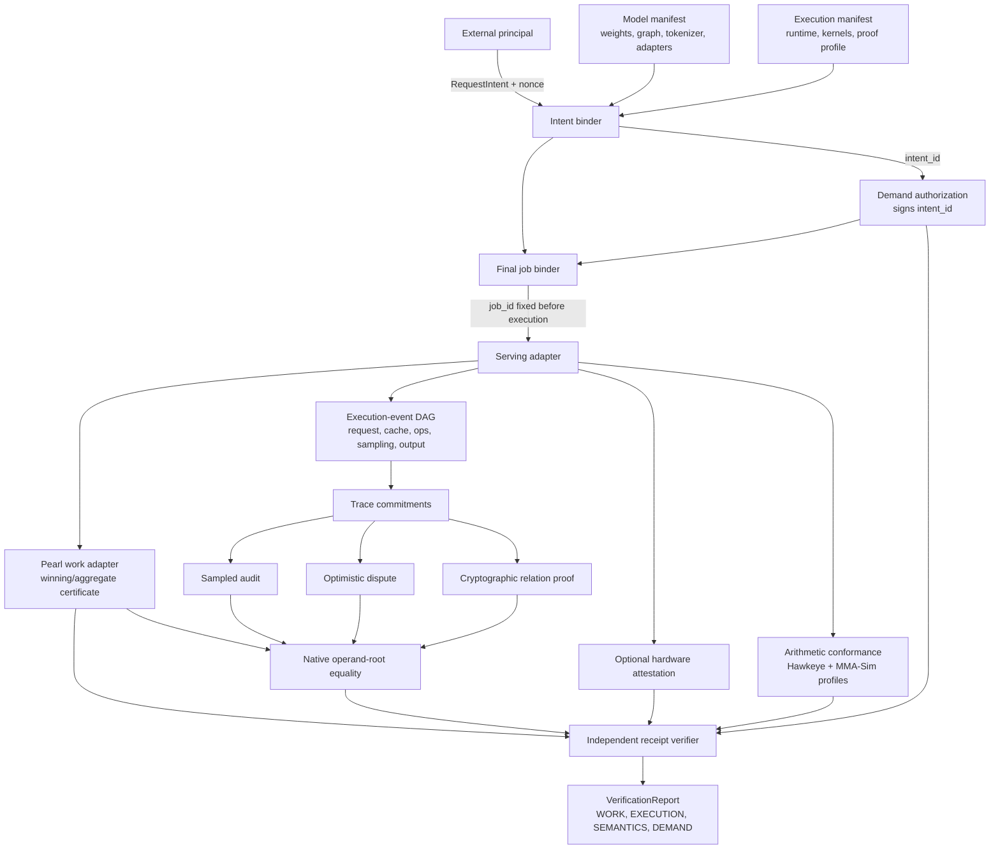

# Aeye Architecture

Status: `proposed`

## Evidence flow

The arrows into the verifier are independent evidence paths. No adapter is Aeye authority,
and the same process may not both produce and independently verify a consequential claim.

## Components

| Component | Responsibility | Explicitly does not decide |
|---|---|---|
| Manifest compiler | Canonicalizes request, model, execution, policy, and proof-profile inputs into roots | Whether declarations are true |
| Intent/final job binder | Produces pre-authorization `intent_id`, then binds the authenticated demand-event root into `job_id` | Authorization truth or execution correctness |
| Serving adapter | Emits stable semantic events from vLLM or another engine | Claim verdicts |
| Trace store | Content-addresses event DAG, tensors/openings, and output | Whether transitions are valid |
| Pearl adapter | Replays certificate parsing/job-key derivation and reports work scope | Model execution, native hardware, demand |
| Model operand scanner | Tests public registered slabs against `hash_b` | Activations, full model, output, usefulness |
| Arithmetic profile registry | Stores executable profiles and retained conformance vectors | Physical device origin |
| Verification backends | Check one versioned relation with one assurance model | Other coordinates |
| Policy evaluator | Checks authorization/payment/freshness rules | Intrinsic demand or utility |
| Cross-evidence binder | Compares native Pearl/execution operand inputs byte-for-byte | Whether either underlying relation is sound |
| Receipt verifier | Recomputes roots, invokes backends, emits claim vector | A single global truth label |
| AEGIS harness | Mutates one invariant at a time and checks claim-local failures | Public network exploitation |

## Two scopes, not one flat receipt

Modern inference batches rows from many requests and reuses cache state. Aeye therefore has:

1. `ExecutionScopeReceipt`: batch step, worker attempt, aggregate trace, or Pearl winning
   instance.
2. `RequestReceipt`: membership proofs selecting the event/tensor portions attributable to
   one job, plus its output.

A request receipt may reference aggregate `WORK` with explicit fractional/unknown coverage.
It must not manufacture a per-request Pearl win.

## Why quantization boundaries are not the protocol invariant

Pearl's retained INT certificate-v3 miner exposes useful bit-exact checkpoints at
quantization boundaries, so they are an efficient historical adapter surface. The proposed
FP8 certificate-v4 exposes a different selected-tile arithmetic relation. Neither is a
stable universal execution model.
Prefill/decode, attention, cache reuse, speculative decoding, fused kernels, MoE routing,
and sampling cross or bypass those boundaries. The protocol invariant is the semantic event
DAG; a quantization checkpoint is one event type.

## Why a lineage root is insufficient

A root can prevent later equivocation. It does not prove that:

- the row map describes the real requester;
- a parent output equals a child input;
- all required layers occurred;
- the output came from the trace; or
- the declared arithmetic was used.

Those statements require a sampled recomputation, honest challenger, attestation assumption,
or cryptographic relation proof. Consequently, Aeye does not request an added Pearl lineage
fold in this phase. Historical Aeye prose used “V4” for that fold; September 2026's Pearl
proposal now uses certificate-v4 for its FP8 scheme. The concepts are unrelated, and all
Aeye evidence must use exact statement identifiers rather than an unqualified version
number.

## Storage and privacy

Canonical manifests and evidence are content-addressed. Raw prompts, raw activations,
private weights, and unrestricted traces are not stored in the public receipt. Openings are
selective and policy-controlled. `A1` openings may leak model/activation information;
`Z3` can offer zero knowledge only if its exact backend and public-input relation do so.
Deletion of private witness material does not delete the immutable public commitment and
must be governed separately.
