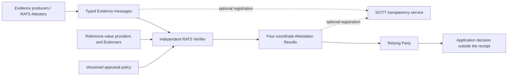

# Standards Crosswalk — 2026-09-20

Status: `observed` standards facts and `proposed` Aeye mapping  
Cutoff: 2026-09-20

## Verdict

Aeye should not present a generic evidence/envelope/verifier/result architecture as novel.
RATS already supplies those roles and conceptual messages. EAT, CMW, CBOR/COSE, and SCITT
already supply mature building blocks for claim sets, message identification, protection,
and transparent registration.

Aeye's defensible research contribution begins after that substrate: the four non-fungible
coordinates, a no-laundering composition rule, inference-specific event and coverage
semantics, Pearl work-to-execution coupling, and explicit impossibility boundaries for
demand and hardware origin.

## Crosswalk

| Aeye object or role | Standards mapping | Decision and boundary |
|---|---|---|
| Provider or evidence producer | RATS `Attester` | Use RATS terminology where it fits. A provider's self-assertion remains Evidence, not an Attestation Result. |
| Independent Aeye verifier | RATS `Verifier` | Appraises evidence under a versioned policy and emits results. Independence is an Aeye policy condition, not implied by the role name. |
| Receipt consumer | RATS `Relying Party` | Applies its own acceptance policy to the four-coordinate result. Aeye does not supply a global acceptance bit. |
| Backend evidence | RATS `Evidence` conceptual message | Pearl proofs, audit transcripts, ZK proofs, arithmetic vectors, and authorizations require distinct media/profile identifiers and exact statement IDs. |
| Arithmetic registries, model registries, vendor material | RATS `Reference Values` and `Endorsements` where semantically correct | A signed registry statement can still be false or compromised. Endorsement is not transition verification. |
| Four-coordinate verification vector | RATS `Attestation Results` conceptual message | Aeye profiles the result into four required coordinates with coverage, assumptions, evidence references, and diagnostics. |
| Appraisal rules | RATS `Appraisal Policy` | Policy identifiers and digests are mandatory. Changing a policy changes the meaning of the result. |
| Hardware/TEE evidence | EAT profile where supported | EAT is suitable for authenticated entity-attestation claims. It is not used to disguise arbitrary ZK or Pearl evidence as hardware attestation. |
| Mixed evidence/result transport | CMW, RFC 9999 | CMW can identify Evidence, Endorsements, Reference Values, Attestation Results, and Appraisal Policies without inventing an Aeye wrapper namespace. A profile and media registrations remain future work. |
| Binary canonical representation | CBOR, RFC 8949, with CDDL | Preferred production direction. No Aeye CBOR/CDDL profile has been accepted, and no private labels have been assigned. |
| Integrity/authenticity protection | COSE, RFC 9052 | A signature authenticates bytes and signer identity under key policy. It does not make a claim true. |
| Research JSON fixtures | Narrow JSON plus JSON Schema; JCS direction from RFC 8785 | Executable now for tests. It is an intentionally restricted research interchange, not a production wire format or standards-conformance claim. |
| Append-only registration and non-equivocation | SCITT architecture, RFC 9943 | Appropriate for signed receipt/evidence history. SCITT explicitly leaves issuer truth and relying-party trust to policy; registration cannot satisfy `EXECUTION`. |

## Standards retained

| Source | Publication | Retained artifact |
|---|---|---|
| RFC 8785, JSON Canonicalization Scheme | June 2020 | `evidence/standards/rfc8785.txt` |
| RFC 8949, CBOR | December 2020 | `evidence/standards/rfc8949.txt` |
| RFC 9052, COSE Structures and Process | August 2022 | `evidence/standards/rfc9052.txt` |
| RFC 9334, RATS Architecture | January 2023 | `evidence/standards/rfc9334.txt` |
| RFC 9711, Entity Attestation Token | April 2025 | `evidence/standards/rfc9711.txt` |
| RFC 9943, SCITT Architecture | June 2026 | `evidence/standards/rfc9943.txt` |
| RFC 9999, RATS Conceptual Message Wrapper | July 2026 | `evidence/standards/rfc9999.txt` |

Exact SHA-256 digests and retrieval dates are in the validated source ledger.

## Message topology

The application decision is deliberately outside the protocol result. Two relying parties
may apply different risk policies to the same immutable vector without changing what was
verified.

## Gaps that standards do not close for Aeye

1. RATS does not define the inference relation or make `WORK`, `EXECUTION`, `SEMANTICS`, and
   `DEMAND` substitutable.
2. CMW transports and identifies conceptual messages; it does not prove their subject
   bindings or enforce a causal event DAG.
3. EAT attests claims under an attestation trust model; it does not provide native-GPU
   arithmetic coverage or eliminate physical attacks.
4. SCITT can make equivocation observable; it cannot establish truth of the registered
   statement.
5. COSE authenticates an issuer; it does not create independence between producer and
   verifier.
6. None of these standards supplies a Pearl-specific proof that a winning operand pair was
   on the causal path of a committed model execution.

## Required work before a production encoding

- write a CDDL profile for the exact four-coordinate result and every extension point;
- choose and register or explicitly private-use media/profile identifiers;
- specify deterministic CBOR and COSE protected headers, algorithm policy, key discovery,
  revocation, countersignatures, and detached payload handling;
- bind RATS freshness mechanisms to Aeye's job and subject roots;
- define SCITT registration policy and reorg/correction behavior without treating a log
  receipt as truth;
- publish positive and negative byte vectors and cross-implementation tests;
- complete privacy analysis for prompts, activations, identities, and selective openings.

Until those items pass review, the JSON schemas remain research controls and no document
may claim RATS, EAT, CMW, COSE, or SCITT conformance.
