# E-000 — native Pearl weight-commitment opening

Status: `blocked` (real-byte pre-candidate calibration retained; source-assurance correction under review; no run attempted)  
Candidate observed: **no**  
Operator acceptance recorded: **no**  
Protocol sequencing: **ADR-0012 and ADR-0013 incorporated; active ADR-0014 unchanged; no successor accepted**

E-000 asks one deliberately narrow question: can a future-selected Pearl mainnet
certificate-v3 `hash_b` be reproduced from a finite, frozen registry of public checkpoint
bytes after the exact pinned Pearl/vLLM runtime transformation, without using operand bytes
supplied by a miner?

A `MATCH` would establish only that one candidate `hash_b` opens to a registered weight
byte string under the frozen recipe and `job_key`. It would not establish live-runtime
participation, valid activations, a complete inference, model identity beyond the matched
bytes, hardware origin, useful work, any Aeye claim coordinate, or demand.

## Predecessor review boundary

The reviewer-owned criteria are retained verbatim in
[`reviewer-freeze.json`](reviewer-freeze.json) and
[`../../docs/E000_ACCEPTANCE_CHECKLIST_2026-09-21.md`](../../docs/E000_ACCEPTANCE_CHECKLIST_2026-09-21.md).
The current freeze bytes have SHA-256
`d37acfa1de34fec048af058bdcabbfb40a3dbf977feddc7d03f259895cb2d419`; the checklist
bytes have SHA-256
`5d2f613f35fae2e46903b67356f493aafcb108326f2d12bc9e33d381e82dd43c`.

The reviewer later returned `AMENDMENTS_CONFIRMED` for commit `8ed1498e` and resolved the
stale `89085d...` digest as a superseded, unretained serialization. That readback is same-
workstation machine review, not operator acceptance. It also made a deeper ordering defect
visible: the manifest places acceptance before registry, recipe, implementation, and
control freezes while requiring registry retrieval before `T_accept` and claiming that the
future candidate does not yet exist when those artifacts are accepted.

[ADR-0012](../../docs/decisions/0012-pre-candidate-freezes-precede-operator-acceptance.md)
therefore blocks use of the reviewed digest triple for acceptance and moves operator
acceptance to the final pre-candidate gate.
[ADR-0013](../../docs/decisions/0013-immutable-manifest-and-external-acceptance-bindings.md)
resolves four later readback defects. The manifest now embeds the candidate-selection
rule, marks both predecessor artifacts historical, states exactly which predecessor
sections remain imported, and permits a reviewer to inspect registry metadata while
forbidding weight bytes and all candidate information. It contains no fresh-review digest:
the fresh freeze, source-bound readback, and operator record bind the immutable manifest
externally, so the digest graph terminates.

[ADR-0014](../../docs/decisions/0014-transport-corroboration-is-not-source-independence.md)
fixes the registry trust boundary. The owner-side program may prequalify two complete,
factually distinct transport retrievals for every shard, but only an external,
digest-bound adjudication may assign T1. T1 does not mean independent publication,
checkpoint reproduction, source authentication, or T2.

That active decision is now challenged by the candidate-blind
[ADR-0015 proposal](../../docs/decisions/0015-source-assurance-requires-independent-derivation.md).
The proposal observes that a second route to the same publisher-frozen length and digest
adds no stronger byte-identity statement. It would replace route-based tiers with explicit
publisher-associated and independently-derived source classes. It has no protocol effect
unless adversarial readback accepts a new immutable `E-000-R2` manifest.

Until those external records exist after Phases 1 through 5, no candidate height, block
hash, certificate, or `hash_b` may be selected or read. The corrected blocked manifest
hashes to
`011d3c232ce9638fc265730f01b13dd3e11d87c225d19ad17842a44d7a78ddc5`; this owner
correction awaits fresh reviewer readback and is not operator acceptance.

## Pre-candidate evidence retained after the manifest freeze

The owner has now crossed the synthetic-to-real-byte boundary without inspecting a chain
candidate:

- a source-derived 8B audit enumerated 5,040 static layouts, of which 3,248 satisfy the
  candidate-independent `(n,k)` dimension filter across the declared TP set;
- Python and separately authored Rust paths agreed on the byte identities of all 3,248
  layouts from the same retained T0 tensor extractions;
- MC1 preregistered 15 distinct family/shape classes and processed 311,427,072 raw bytes
  per lane. Python, Rust, and Pearl's pinned keyed-tree implementation agreed on all 15
  roots under a frozen synthetic non-candidate key;
- the MC1 comparator rejected nine post-hoc transcript mutations, and a locked replay
  reproduced all three result files byte-for-byte; and
- the first and only capture in a separate exporter calibration ended before the declared
  `Content-Length`. Its stop rule prevented the second capture and comparison, so no route
  tier was produced.

The [dated evidence record](../../docs/E000_PRE_CANDIDATE_EVIDENCE_2026-09-21.md) gives the
counts, correction to the `(n,k)` coverage predicate, terminal failure, and exact
non-claims. The [MC1 packet](mc1/README.md) retains the source and result metadata. Neither
artifact is an E-000 outcome or independent validation.

```mermaid
flowchart LR
    accTitle: E-000 fail-closed phase order
    accDescr: The corrected order freezes sources, registry, recipe, two implementations, and all controls before fresh review and exact operator acceptance start the future-block clock. The target commitment remains sealed until one final comparison.

    S["1 Source pins"] --> R["2 Registry freeze"]
    R --> T["3 Transform freeze"]
    T --> I["4 Two implementation freezes"]
    I --> K["5 Thirty controls"]
    K --> A["6 Fresh review +<br/>external acceptance"]
    A --> C["7 Future candidate + sealed hash_b"]
    C --> V["8 Reveal"]
    V --> O["9 One comparison + terminal state"]

    classDef ready fill:#e6f4ea,stroke:#1a7f37,color:#0f3d1c;
    classDef pending fill:#fff4e5,stroke:#b54708,color:#4a2500;
    classDef forbidden fill:#fff1f0,stroke:#cf222e,color:#4c1114;
    class S ready;
    class A,R,T,I,K pending;
    class C,V,O forbidden;
```



## Implemented pre-candidate instruments

- [`conformance.py`](conformance.py) round-trips the pinned V3 envelope, reconstructs the
  76-byte header and 52-byte mining configuration, derives `job_key`, checks header and
  proof-commitment binding, and computes the padded keyed-BLAKE3 slab root through an
  optimized library and a small separately written reference implementation.
- [`slab_recipe.py`](slab_recipe.py) evaluates explicit, schema-checked int8 fusion,
  slicing, transposition, and stacking recipes while recording intermediate digests. It
  never guesses a missing transform.
- [`registry.py`](registry.py) validates the strict checkpoint-registry schema and derives
  T0 or structural eligibility for external T1 review from retained per-shard transport
  facts. It rejects incomplete shard coverage, relabeled paths, redirect reuse, shared
  streams, truncated transfers, digest mismatch, missing transcripts, unsafe tier
  language, candidate material, and model-weight bytes. Its output contract is
  [`e000-registry-prequalification-v0.schema.json`](../../schemas/e000-registry-prequalification-v0.schema.json).
  The CLI rejects duplicate JSON members and non-finite numbers, and binds its report to
  the exact input-file digest. Version 0 cannot assign T1 or emit T2.
- [`pearl-oracle/`](pearl-oracle/) calls pinned Pearl `zk_pow::api` types for structured
  header/config serialization and V3 seed derivation, and `pearl-blake3` for `job_key` and
  matrix-root parity.
- [`verify_pearl_oracle.py`](verify_pearl_oracle.py) compares both Aeye hashing lanes with
  that oracle on deterministic synthetic bytes and executes Pearl-adjudicated byte-order,
  mining-configuration, and Legacy-versus-Salted controls.
- [`audit_reviewer_freeze.py`](audit_reviewer_freeze.py) checks the amended manifest
  semantically against all twelve reviewer amendments, the four ADR-0013 binding repairs,
  and current historical-file digests. It is an owner self-check, never reviewer approval
  or operator acceptance.
- [`mc1/`](mc1/README.md) retains the preregistered, source-only real-byte calibration:
  two reconstruction lanes, the pinned-Pearl comparison results, a replay receipt, and the
  mutation harness. Public checkpoint payload bytes are not in the repository.
- [`source_assurance.py`](source_assurance.py) is an executable proposal accompanying
  ADR-0015. It demonstrates that route diversity remains an observation while only exact
  independent derivation can upgrade the proposed source class. It cannot assign an
  active E-000 tier.

These are conformance instruments, not the two frozen E-000 implementations. The Python
modules share orchestration and fixtures, checkpoint extraction is not yet implemented in
two independent paths, and the complete 30-control matrix has not passed in both paths.
The generic parser also exercises Pearl's variable-length MoE form for source conformance;
the actual E-000 policy lane must reject every non-164-byte or MoE artifact because the
frozen experiment is dense-only.

## Local replay

After installing the hash-locked development dependencies and hydrating ledger-pinned
source checkouts:

```bash
python3 experiments/e-000/conformance.py
python3 experiments/e-000/audit_reviewer_freeze.py
python3 experiments/e-000/verify_pearl_oracle.py
python3 -m unittest tests.test_e000_conformance -v
python3 -m unittest tests.test_e000_registry -v
python3 -m unittest tests.test_e000_mc1 -v
python3 -m unittest tests.test_e000_source_assurance -v
python3 -m unittest tests.test_e000_calibration_terminal -v
```

The expected result is synthetic parser/hash parity with `candidate_inspected=false`.
These commands perform no chain query, model download, transaction, mining, or target
comparison.

## Remaining gates before any candidate

1. Resolve the source-assurance protocol before performing another large retrieval. Under
   the active E-000 manifest this still means T1 adjudication under ADR-0014. If ADR-0015
   survives review, preserve E-000 and issue `E-000-R2` with explicit `S0`/`S1` classes;
   do not edit or reinterpret the active manifest.
2. Retain two truly code-path-independent checkpoint-to-root implementations and compare
   every intermediate transcript field.
3. Make all 30 frozen controls produce their exact diagnostics in both implementations,
   with the pinned Pearl oracle used only where it has authority.
4. Obtain a fresh adversarial freeze and source-bound readback of the immutable manifest
   and every Phase 1 through 5 artifact. The reviewer may inspect registry metadata and
   digests but no weight bytes, mainnet query, candidate data, certificate, or `hash_b`.
5. Qualify the future candidate separately with Pearl's pinned native V3 verifier; acceptance
   does not enlarge the `hash_b`-only E-000 claim.
6. Only after the pre-candidate gates and fresh review, retain the exact digest-citing
   external operator acceptance record and
   apply the future-block selection rule.

If any prerequisite cannot be established, E-000 emits `BLOCKED`; it does not silently
relax the criterion. If protocol order or frozen state is violated, it emits `INVALID`.
