# E-000 — native Pearl weight-commitment opening

Status: `blocked` (corrected sequence awaiting fresh review and pre-candidate artifacts; no run attempted)  
Candidate observed: **no**  
Operator acceptance recorded: **no**  
Protocol sequencing: **ADR-0012 and ADR-0013 incorporated; pre-candidate artifacts and fresh review pending**

E-000 asks one deliberately narrow question: can a future-selected Pearl mainnet
certificate-v3 `hash_b` be reproduced from a finite, frozen registry of public checkpoint
bytes after the exact pinned Pearl/vLLM runtime transformation, without using operand bytes
supplied by a miner?

A `MATCH` would establish only registered-runtime-slab participation for one block. It
would not establish valid activations, a complete inference, model identity beyond the
matched byte-string, hardware origin, useful work, any Aeye claim coordinate, or demand.

## Predecessor review boundary

The reviewer-owned criteria are retained verbatim in
[`reviewer-freeze.json`](reviewer-freeze.json) and
[`../../docs/E000_ACCEPTANCE_CHECKLIST_2026-09-21.md`](../../docs/E000_ACCEPTANCE_CHECKLIST_2026-09-21.md).
The current freeze bytes have SHA-256
`d37acfa1de34fec048af058bdcabbfb40a3dbf977feddc7d03f259895cb2d419`; the checklist
bytes have SHA-256
`5d2f613f35fae2e46903b67356f493aafcb108326f2d12bc9e33d381e82dd43c`.

The reviewer later returned `AMENDMENTS_CONFIRMED` for commit `8ed1498e` and resolved the
stale `89085d...` digest as a superseded, unretained serialization. That readback is same-
workstation machine review, not operator acceptance. It also made a deeper ordering defect
visible: the manifest places acceptance before registry, recipe, implementation, and
control freezes while requiring registry retrieval before `T_accept` and claiming that the
future candidate does not yet exist when those artifacts are accepted.

[ADR-0012](../../docs/decisions/0012-pre-candidate-freezes-precede-operator-acceptance.md)
therefore blocks use of the reviewed digest triple for acceptance and moves operator
acceptance to the final pre-candidate gate.
[ADR-0013](../../docs/decisions/0013-immutable-manifest-and-external-acceptance-bindings.md)
resolves four later readback defects. The manifest now embeds the candidate-selection
rule, marks both predecessor artifacts historical, states exactly which predecessor
sections remain imported, and permits a reviewer to inspect registry metadata while
forbidding weight bytes and all candidate information. It contains no fresh-review digest:
the fresh freeze, source-bound readback, and operator record bind the immutable manifest
externally, so the digest graph terminates.

Until those external records exist after Phases 1 through 5, no candidate height, block
hash, certificate, or `hash_b` may be selected or read. The corrected blocked manifest
hashes to
`011d3c232ce9638fc265730f01b13dd3e11d87c225d19ad17842a44d7a78ddc5`; this owner
correction awaits fresh reviewer readback and is not operator acceptance.



```mermaid
flowchart LR
    accTitle: E-000 fail-closed phase order
    accDescr: The corrected order freezes sources, registry, recipe, two implementations, and all controls before fresh review and exact operator acceptance start the future-block clock. The target commitment remains sealed until one final comparison.

    S["1 Source pins"] --> R["2 Registry freeze"]
    R --> T["3 Transform freeze"]
    T --> I["4 Two implementation freezes"]
    I --> K["5 Thirty controls"]
    K --> A["6 Fresh review +<br/>external acceptance"]
    A --> C["7 Future candidate + sealed hash_b"]
    C --> V["8 Reveal"]
    V --> O["9 One comparison + terminal state"]

    classDef ready fill:#e6f4ea,stroke:#1a7f37,color:#0f3d1c;
    classDef pending fill:#fff4e5,stroke:#b54708,color:#4a2500;
    classDef forbidden fill:#fff1f0,stroke:#cf222e,color:#4c1114;
    class S ready;
    class A,R,T,I,K pending;
    class C,V,O forbidden;
```

## Implemented pre-candidate instruments

- [`conformance.py`](conformance.py) round-trips the pinned V3 envelope, reconstructs the
  76-byte header and 52-byte mining configuration, derives `job_key`, checks header and
  proof-commitment binding, and computes the padded keyed-BLAKE3 slab root through an
  optimized library and a small separately written reference implementation.
- [`slab_recipe.py`](slab_recipe.py) evaluates explicit, schema-checked int8 fusion,
  slicing, transposition, and stacking recipes while recording intermediate digests. It
  never guesses a missing transform.
- [`pearl-oracle/`](pearl-oracle/) calls pinned Pearl `zk_pow::api` types for structured
  header/config serialization and V3 seed derivation, and `pearl-blake3` for `job_key` and
  matrix-root parity.
- [`verify_pearl_oracle.py`](verify_pearl_oracle.py) compares both Aeye hashing lanes with
  that oracle on deterministic synthetic bytes and executes Pearl-adjudicated byte-order,
  mining-configuration, and Legacy-versus-Salted controls.
- [`audit_reviewer_freeze.py`](audit_reviewer_freeze.py) checks the amended manifest
  semantically against all twelve reviewer amendments, the four ADR-0013 binding repairs,
  and current historical-file digests. It is an owner self-check, never reviewer approval
  or operator acceptance.

These are conformance instruments, not the two frozen E-000 implementations. The Python
modules share orchestration and fixtures, checkpoint extraction is not yet implemented in
two independent paths, and the complete 30-control matrix has not passed in both paths.
The generic parser also exercises Pearl's variable-length MoE form for source conformance;
the actual E-000 policy lane must reject every non-164-byte or MoE artifact because the
frozen experiment is dense-only.

## Local replay

After installing the hash-locked development dependencies and hydrating ledger-pinned
source checkouts:

```bash
python3 experiments/e-000/conformance.py
python3 experiments/e-000/audit_reviewer_freeze.py
python3 experiments/e-000/verify_pearl_oracle.py
python3 -m unittest tests.test_e000_conformance -v
```

The expected result is synthetic parser/hash parity with `candidate_inspected=false`.
These commands perform no chain query, model download, transaction, mining, or target
comparison.

## Remaining gates before any candidate

1. Freeze a finite T1-or-better checkpoint registry and a source-cited transformation
   recipe, including the tensor-parallel degree set.
2. Retain two truly code-path-independent checkpoint-to-root implementations and compare
   every intermediate transcript field.
3. Make all 30 frozen controls produce their exact diagnostics in both implementations,
   with the pinned Pearl oracle used only where it has authority.
4. Obtain a fresh adversarial freeze and source-bound readback of the immutable manifest
   and every Phase 1 through 5 artifact. The reviewer may inspect registry metadata and
   digests but no weight bytes, mainnet query, candidate data, certificate, or `hash_b`.
5. Qualify the future candidate separately with Pearl's pinned native V3 verifier; acceptance
   does not enlarge the `hash_b`-only E-000 claim.
6. Only after the pre-candidate gates and fresh review, retain the exact digest-citing
   external operator acceptance record and
   apply the future-block selection rule.

If any prerequisite cannot be established, E-000 emits `BLOCKED`; it does not silently
relax the criterion. If protocol order or frozen state is violated, it emits `INVALID`.
